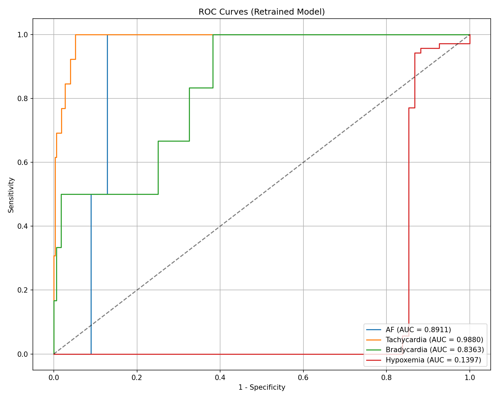
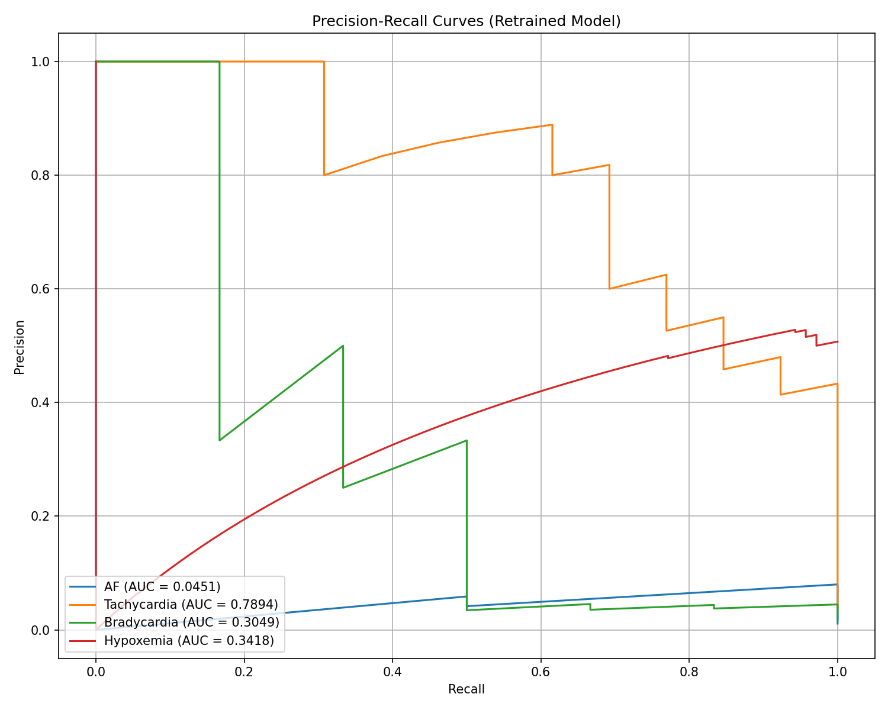
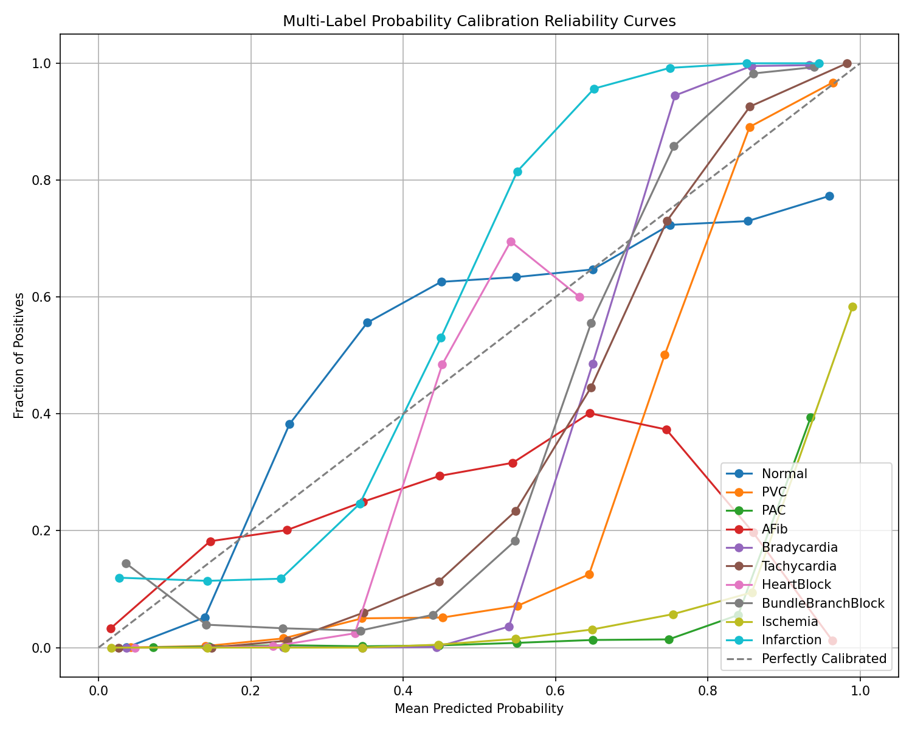
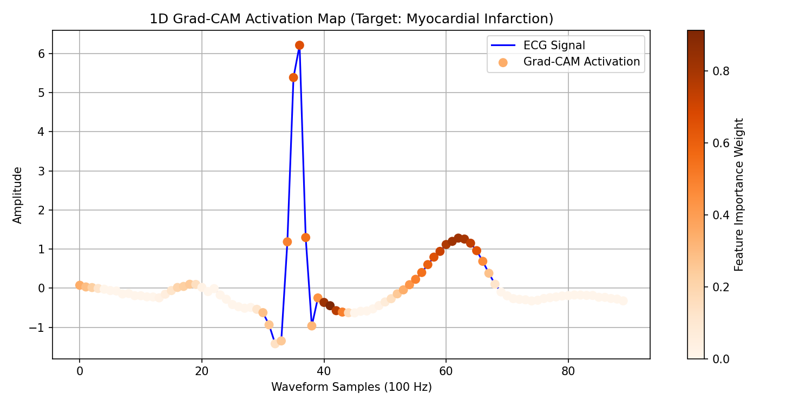
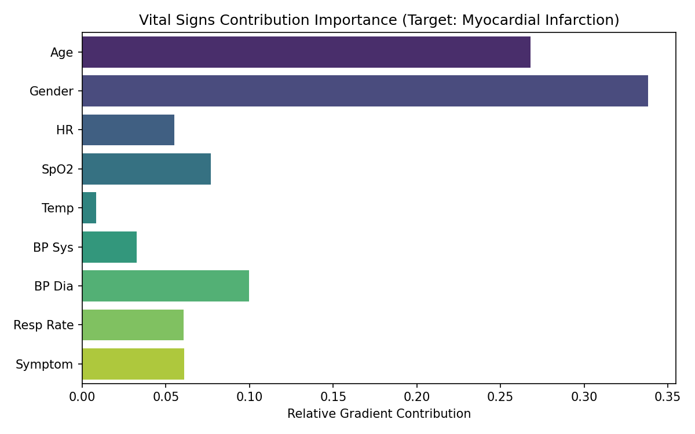

# PulseTech Multimodal Edge AI - Clinical Performance Report

- **Evaluation Date**: 2026-08-16 12:03:38
- **Primary Classifier**: Hybrid_CNN_BiLSTM

## Per-Class Sensitivity, Specificity, MCC, and Tuned Decision Thresholds

| Class Name | Sensitivity (Recall) | Specificity | MCC | Optimal Threshold | F1-Score [95% CI] | AUPRC [95% CI] |
| --- | --- | --- | --- | --- | --- | --- |
| Normal | 0.9771 | 0.7642 | 0.7006 | 0.23 | 0.8874 [0.795, 0.805] | 0.7781 [0.771, 0.787] |
| PVC | 0.8440 | 0.9759 | 0.7205 | 0.61 | 0.9484 [0.714, 0.746] | 0.8692 [0.856, 0.883] |
| PAC | 0.6129 | 0.8631 | 0.0981 | 0.52 | 0.1139 [0.036, 0.052] | 0.1640 [0.109, 0.229] |
| AFib | 0.2394 | 0.8996 | 0.1177 | 0.45 | 0.7164 [0.184, 0.209] | 0.1547 [0.148, 0.161] |
| Bradycardia | 0.9961 | 0.9879 | 0.8790 | 0.50 | 0.0000 [0.866, 0.891] | 0.9919 [0.986, 0.996] |
| Tachycardia | 0.9164 | 0.9871 | 0.9078 | 0.61 | 0.9711 [0.917, 0.927] | 0.9796 [0.978, 0.981] |
| HeartBlock | 0.4889 | 0.9991 | 0.5754 | 0.50 | 0.0000 [0.495, 0.636] | 0.5829 [0.504, 0.680] |
| BundleBranchBlock | 0.2315 | 0.9927 | 0.4035 | 0.50 | 0.0000 [0.350, 0.374] | 0.3440 [0.333, 0.354] |
| Ischemia | 0.9997 | 0.7835 | 0.6440 | 0.50 | 0.0000 [0.686, 0.699] | 0.5738 [0.561, 0.587] |
| Infarction | 0.3026 | 0.9980 | 0.5039 | 0.50 | 0.0000 [0.450, 0.475] | 0.5106 [0.500, 0.522] |

## Evaluation Visualizations

### Receiver Operating Characteristic (ROC) Curves

### Precision-Recall Curves

### Reliability Calibration Curves

### Explainable AI - Grad-CAM ECG Map

### Vital Parameters Contribution Saliency

